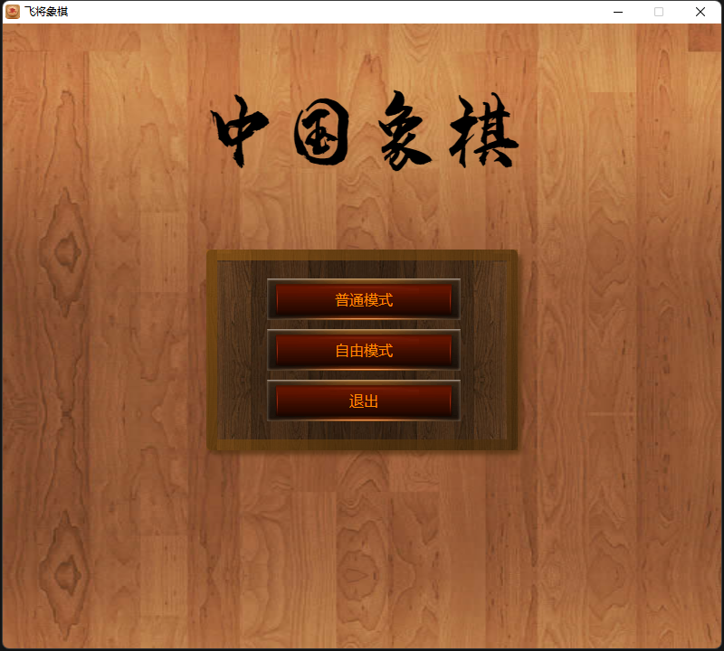
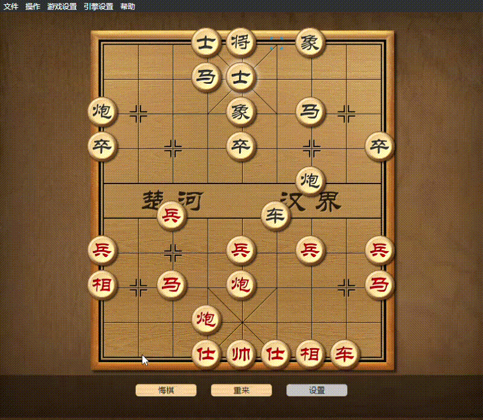

# 飞将象棋

`飞将象棋`是一款基于`Electorn`开发的开源象棋软件，目前内置四款引擎（`象眼(ElephantEye)`，`旋风(cyclone)`，`佳佳(gg)`，`南奥(sachess)`）。目前由于引擎限制，只能运行在Windows平台。

- [飞将象棋](#飞将象棋)
  - [游戏截图](#游戏截图)
  - [游戏动画](#游戏动画)
  - [主要功能](#主要功能)
    - [基础功能](#基础功能)
    - [对局](#对局)
    - [界面](#界面)
    - [音乐](#音乐)
    - [象棋引擎](#象棋引擎)
    - [辅助功能](#辅助功能)
  - [版本更新说明](#版本更新说明)
    - [v0.0.14](#v0014)
  - [感谢](#感谢)
## 游戏截图

## 游戏动画

## 主要功能
### 基础功能

| 功能项   | 是否支持(版本) | 待开发 |
| -------- | -------------- | ------ |
|          |                |        |
| 悔棋     | 支持（v0.0.8)  |        |
| 重新开始 | 支持（v0.0.12) |        |
| 将军判定 | 支持（v0.0.8)  |        |
| 胜负判定 | 支持（v0.0.8)  |        |
### 对局

| 功能项   | 是否支持(版本) | 待开发 |
| -------- | -------------- | ------ |
|          |                |        |
| 人机对战 | 支持（v0.0.2)  |        |
| 机器对战 | 支持（v0.0.12) |        |
| 人人对战 | 支持（v0.0.8)  |        |
| 网络对战 | 不支持 |      是  |

### 界面

| 功能项   | 是否支持(版本) | 待开发 |
| -------- | -------------- | ------ |
| 走棋动画 | 支持（v0.0.8)  |        |
| 可走步数 | 支持（v0.0.12) |        |
| 最新行棋 | 支持（v0.0.12) |        |
| 引擎分析 | 支持（v0.0.12) |        |

### 音乐
| 功能项       | 是否支持(版本) | 待开发 |
| ------------ | -------------- | ------ |
| 背景音乐     | 支持 （v0.0.6) |        |
| 关闭背景音乐 | 支持 （v0.0.8) |        |

### 象棋引擎
| 功能项   | 是否支持(版本)  | 待开发 |
| -------- | --------------- | ------ |
| UCI引擎  | 支持 （v0.0.12) |        |
| UUCI引擎 | 支持 （v0.0.6)  |        |
| 引擎设置 | 不支持        | 是     |
| 引擎选择 | 支持 （v0.0.12) |        |
| 多引擎   | 支持 （v0.0.12) |        |
| 设置开局库   | 不支持         | 是     |
| 自定义开局库 | 不支持         | 是     |
| 设置残局库   | 不支持         | 是     |
| 自定义残局库 | 不支持         | 是     |

### 辅助功能

| 功能项       | 是否支持(版本) | 待开发 |
| ------------ | -------------- | ------ |
| 多语言       | 不支持         | 是     |
| 保存棋谱     | 不支持         | 是     |
| 读取棋谱     | 不支持         | 是     |

## 版本更新说明

### v0.0.14
- 修复关于菜单显示的问题
- 修复打包名称问题

## 感谢

- ElephantEye `ElephantEye` 是一款自由的中国象棋程序，在遵循《GNU宽松通用公共许可协议》(GNU Lesser General Public Licence)的前提下，广大象棋爱好者和程序设计师可以自由使用 ElephantEye 及其源程序。如果要获得关于 ElephantEye 的更加详细的信息，可登录《象棋百科全书》网站：http://www.elephantbase.net/