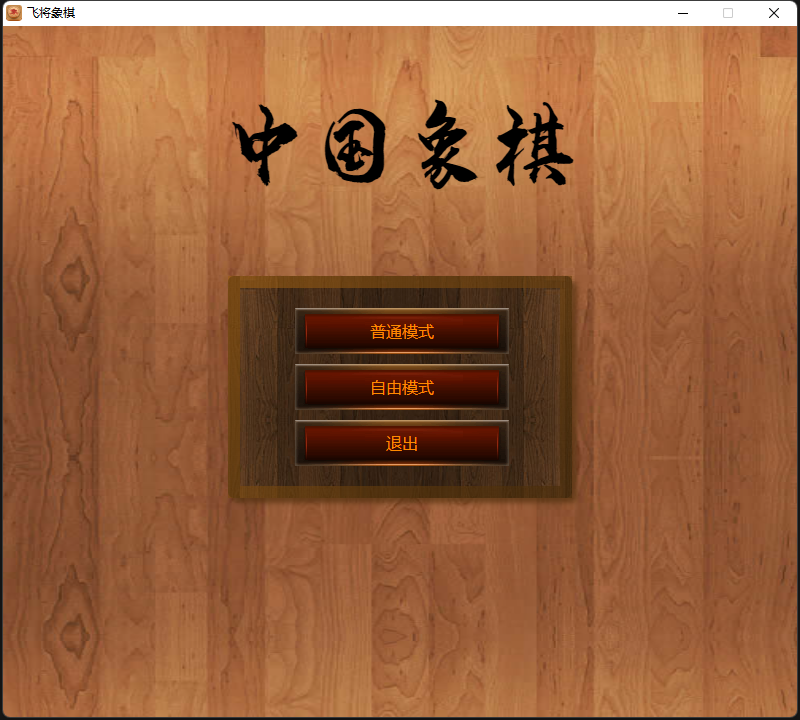
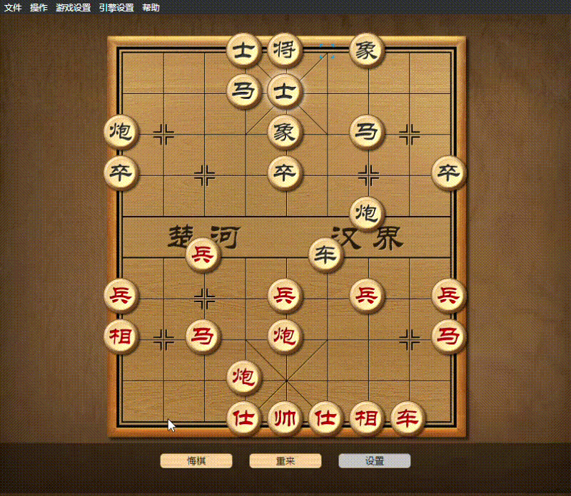

# 飞将象棋

`飞将象棋`是一款基于`Electorn`开发的开源象棋软件，目前内置四款引擎（`象眼(ElephantEye)`，`旋风(cyclone)`，`佳佳(gg)`，`南奥(sachess)`），同时支持添加自定义UCI/UCCI引擎（如`Pikafish`）。目前由于引擎限制，只能运行在Windows平台。

- [飞将象棋](#飞将象棋)
  - [游戏截图](#游戏截图)
  - [游戏动画](#游戏动画)
  - [主要功能](#主要功能)
    - [基础功能](#基础功能)
    - [对局](#对局)
    - [界面](#界面)
    - [音乐](#音乐)
    - [象棋引擎](#象棋引擎)
    - [辅助功能](#辅助功能)
  - [版本更新说明](#版本更新说明)
    - [v0.0.14](#v0014)
  - [感谢](#感谢)
## 游戏截图

## 游戏动画

## 主要功能
### 基础功能

| 功能项   | 是否支持(版本) | 待开发 |
| -------- | -------------- | ------ |
|          |                |        |
| 悔棋     | 支持（v0.0.8)  |        |
| 重新开始 | 支持（v0.0.12) |        |
| 将军判定 | 支持（v0.0.8)  |        |
| 胜负判定 | 支持（v0.0.8)  |        |
### 对局

| 功能项   | 是否支持(版本) | 待开发 |
| -------- | -------------- | ------ |
|          |                |        |
| 人机对战 | 支持（v0.0.2)  |        |
| 机器对战 | 支持（v0.0.12) |        |
| 人人对战 | 支持（v0.0.8)  |        |
| 网络对战 | 不支持 |      是  |

### 界面

| 功能项   | 是否支持(版本) | 待开发 |
| -------- | -------------- | ------ |
| 走棋动画 | 支持（v0.0.8)  |        |
| 可走步数 | 支持（v0.0.12) |        |
| 最新行棋 | 支持（v0.0.12) |        |
| 引擎分析 | 支持（v0.0.12) |        |

### 音乐
| 功能项       | 是否支持(版本) | 待开发 |
| ------------ | -------------- | ------ |
| 背景音乐     | 支持 （v0.0.6) |        |
| 关闭背景音乐 | 支持 （v0.0.8) |        |

### 象棋引擎
| 功能项       | 是否支持(版本)  | 待开发 |
| ------------ | --------------- | ------ |
| UCI引擎      | 支持 （v0.0.12) |        |
| UCCI引擎     | 支持 （v0.0.6)  |        |
| 自定义引擎   | 支持 （v0.0.16) |        |
| 引擎配置管理 | 支持 （v0.0.16) |        |
| 引擎选择     | 支持 （v0.0.12) |        |
| 多引擎       | 支持 （v0.0.12) |        |
| 设置开局库   | 不支持          | 是     |
| 自定义开局库 | 不支持          | 是     |
| 设置残局库   | 不支持          | 是     |
| 自定义残局库 | 不支持          | 是     |

### 辅助功能

| 功能项       | 是否支持(版本) | 待开发 |
| ------------ | -------------- | ------ |
| 多语言       | 不支持         | 是     |
| 保存棋谱     | 支持 (v0.0.15) |        |
| 读取棋谱     | 支持 (v0.0.15) |        |
| 导出PGN      | 支持 (v0.0.15) |        |
| 棋谱回放     | 支持 (v0.0.15) |        |
| 自动保存     | 支持 (v0.0.15) |        |
| 崩溃恢复     | 支持 (v0.0.15) |        |

### 棋谱功能 (v0.0.15 新增)

飞将象棋支持完整的棋谱保存与加载功能：

- **保存棋谱** (Ctrl+S): 将当前对局保存为 JSON 格式文件
- **加载棋谱** (Ctrl+O): 从文件加载历史棋谱进行回顾
- **导出PGN** (Ctrl+E): 导出为标准 PGN 格式，可在其他象棋软件中打开
- **棋谱回放**: 加载棋谱后可逐步浏览每一步走棋
- **继续对局**: 可从棋谱的任意位置继续与AI或玩家对弈
- **自动保存**: 每次走棋后自动保存，防止意外关闭丢失进度
- **崩溃恢复**: 应用重启时自动检测并恢复上次未保存的对局

棋谱文件默认保存在 `%APPDATA%/飞将象棋/save/` 目录。

### 自定义引擎 (v0.0.16 新增)

飞将象棋支持添加自定义 UCI/UCCI 引擎：

- **添加引擎**: 通过菜单添加本地引擎可执行文件（.exe）
- **自动检测**: 自动检测引擎协议类型（UCI 或 UCCI）
- **引擎配置**: 支持配置线程数和哈希表大小
- **默认引擎**: 可设置任意引擎为默认引擎
- **推荐引擎**: [Pikafish](https://github.com/official-pikafish/Pikafish) - 开源高性能中国象棋引擎

引擎配置文件保存在 `%APPDATA%/飞将象棋/engines.json`。

## 版本更新说明

### v0.0.16
- 新增自定义引擎支持，可添加 Pikafish 等第三方 UCI/UCCI 引擎
- 新增引擎配置管理功能（添加、删除、设置默认引擎）
- 修复 UCI 引擎初始化问题，确保 `readyok` 响应正确处理
- 修复 UCI 引擎 position 命令格式问题
- 引擎配置持久化存储在 `%APPDATA%/飞将象棋/engines.json`

### v0.0.15
- 新增棋谱保存与加载功能
- 新增 PGN 格式导出
- 新增棋谱回放功能
- 新增自动保存与崩溃恢复

### v0.0.14
- 修复关于菜单显示的问题
- 修复打包名称问题

## 感谢

- ElephantEye `ElephantEye` 是一款自由的中国象棋程序，在遵循《GNU宽松通用公共许可协议》(GNU Lesser General Public Licence)的前提下，广大象棋爱好者和程序设计师可以自由使用 ElephantEye 及其源程序。如果要获得关于 ElephantEye 的更加详细的信息，可登录《象棋百科全书》网站：http://www.elephantbase.net/